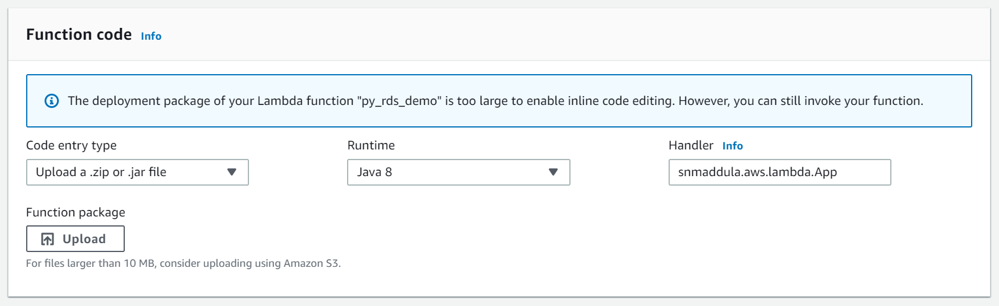
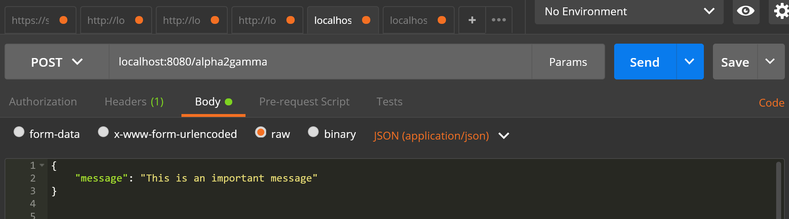
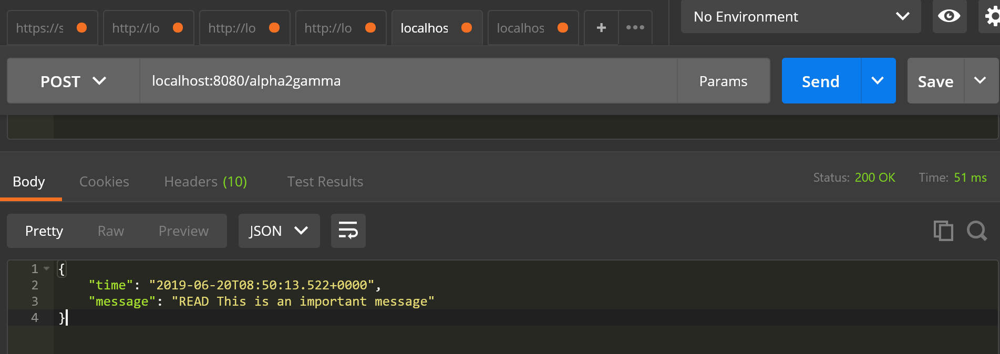

# Spring Cloud Function for AWS Lambda
### A very basic lambda function which accepts a `message` and acknowledges back

## Configuring Lambda Handler on AWS Console

### To Test Locally follow the below steps

#### 1. Run using the below command

`
    mvn clean spring-boot:run
`

#### 2. Request: Provide the message and invoke POST endpoint

#### 3. Response: Responds with Acknowledgement

